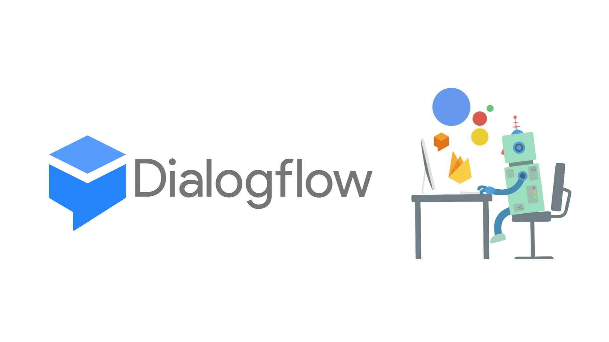

# Python Webhook for integrating CloudSQL database with Dialogflow CX chatbot
This article is about Building a Hotel booking Chatbot in Dialogflow CX and integrating it with Mysql backend database which is hosted on Google Cloud SQL using Python webhooks. This article gives you an overview of how to build Entities, Intents, Route groups, python webhooks, Flows, and  Pages.

Dialogflow CX provides a new way of designing agents, taking a state machine approach to agent design. This gives you clear and explicit control over a conversation, a better end-user experience, and a better development workflow.

CX is firmly embedded as an extension of the Google Cloud Platform offering.

Chatbot Overview: The Chatbot is build to demonstrate following tasks related to the hotel booking:
1. Booking a room in hotel
2. Checking for Booking Status
3. Cancel the booking
